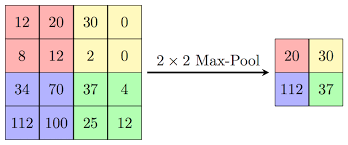
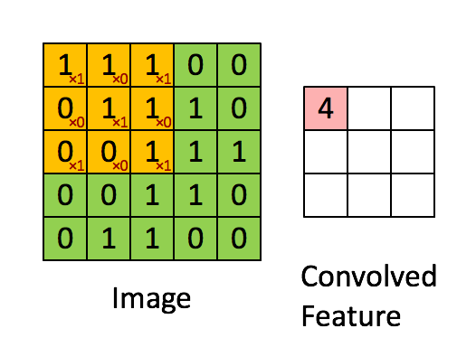

# Image generation

- Parametric models (fixed number of parameters)
- Non-parametric models( Parameters scale with the number of data points)
  > GANs are considered Parametric models because they have a fixed number of parameters when trained. Researchers have tried multiple ways to generate images using recurrent networks (Gregor et al., 2015) and deconvolutional network approach (Dosovitskiy et al., 2014) but they have not been able to generate images using labels (i.e. generate images of cats with a label of cat). GANs have the ability to generate images using labels also known as CGANs but first I will be looking out what a DC-GAN is and how it works.

# Deep Convolutional GANs (DCGANs)

- Unsupervised learning because it doesn't require labels ( tho there is CGAN which does require labels but thats semi-supervised learning)
-

## Information about Architectures to note about DCGANs

### Remove max pooling layers and replace with strided convolutions (discriminator) and fractional-strided convolutions (generator)

> GAN researchers have figured that maxpooling layers do not help generating images as it prevents the neural network model from learning its own spatial downsampling. (Radford et al., 2015) This is the reason why most GANs example we see these days are fully strided convolutional layers 0 pooling.

#### Spatial Downsampling in GANs
> reducing the resolution of an image through convolutions while learning the features of the image

>Striding convolutions : strides; the filter moving through the image and getting a matrix of convolved features. The main purpose of doing this is to find features of a class which will then be used for determining if the image is real or fake. In having more convolutions, the neural network model will be able to learn more features of the image and in turn the generator will learn the features of the image and be able to generate images.

### Leaky relu activation function used for both(This is my hypothesis but research shows relu is used for generator and leaky relu is used for discriminator)

> Leaky relu is used instead of relu because it prevents the dying relu problem. The dying relu problem is when the gradient of the relu function is 0 and the neural network model stops learning. Leaky relu solves this problem by having a small negative slope when the input is negative. This allows the neural network model to continue learning even when the gradient is 0.

### Pixel Scaling

> I will be trying out 2 types of scaling ( between 0 and 1 ) AKA normalization vs ( between -1 and 1 AKA Centering) There is a lot of debate on which one is better and although majority has tried and concluded that zero-centered Normal distribution is better. I will still be trying both and see which one works better.
> I will first try out the normalization method and then the centering method on model 2

## Describe discriminator

show pics or model

## Describe generator

show model sum

## train step for dcgan

Tf.gradienttape()
Pass in a function such as y=x\*\*2
It will retrieve the gradient of the function which in the above function will be 6

- Why do we need to use gradient tape?
  We use gradient tape for faster backpropagation.

## Hitting nash equilibrium

# Improvements

- Add augmenting
- Add batch normalization for both generator and discriminator
- RELU for generator instead of leaky relu

## Eliminating fully connected layers on top of convolutional features

> using GlobalAveragePooling2D at the last lalyer of Discriminators (Radford et al., 2015) (will hurt convergence speed)

## Batch normalization (Ioffe and Szegedy, 2015)

Radford, A., Metz, L., Chintala, S., 2015. Unsupervised Representation Learning with Deep Convolutional Generative Adversarial Networks [WWW Document]. arXiv.org. URL https://arxiv.org/abs/1511.06434v2 (accessed 1.30.23).

## To do for dcgan

- [x] Add batch normalization for both generator and discriminator
- [x] Add augmenting
- [x] Add RELU for generator instead of leaky relu
- [x] Add GlobalAveragePooling2D at the last layer of Discriminators
- [x] label smoothing
