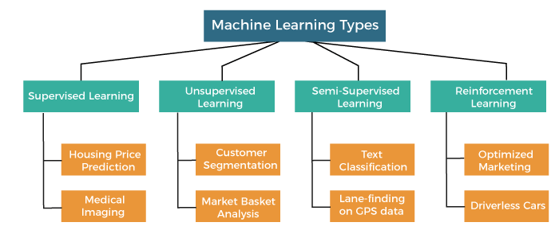

# 1. Image generation

- Parametric models (fixed number of parameters)
- Non-parametric models( Parameters scale with the number of data points)
  > GANs are considered Parametric models because they have a fixed number of parameters when trained. Researchers have tried multiple ways to generate images using recurrent networks (Gregor et al., 2015) and deconvolutional network approach (Dosovitskiy et al., 2014) but they have not been able to generate images using labels (i.e. generate images of cats with a label of cat). GANs have the ability to generate images using labels also known as CGANs but first I will be looking out what a DC-GAN is and how it works.

# 2. Deep Convolutional GANs (DCGANs)

- Unsupervised learning because it doesn't require labels ( tho there is CGAN which does require labels but thats semi-supervised learning)

## 2.1 Information about Architectures to note about DCGANs

### 2.1.2 Remove max pooling layers and replace with strided convolutions (discriminator) and fractional-strided convolutions (generator)

> GAN researchers have figured that maxpooling layers do not help generating images as it prevents the neural network model from learning its own spatial downsampling. (Radford et al., 2015) This is the reason why most GANs example we see these days are fully strided convolutional layers 0 pooling.

### 2.1.3 Spatial Downsampling in GANs
> reducing the resolution of an image through convolutions while learning the features of the image

>Striding convolutions : strides; the filter moving through the image and getting a matrix of convolved features. The main purpose of doing this is to find features of a class which will then be used for determining if the image is real or fake. In having more convolutions, the neural network model will be able to learn more features of the image and in turn the generator will learn the features of the image and be able to generate images.

### 2.1.4 Leaky relu activation function used for both(This is my hypothesis but research shows relu is used for generator and leaky relu is used for discriminator)

> Leaky relu is used instead of relu because it prevents the dying relu problem. The dying relu problem is when the gradient of the relu function is 0 and the neural network model stops learning. Leaky relu solves this problem by having a small negative slope when the input is negative. This allows the neural network model to continue learning even when the gradient is 0.

### 2.1.5 Adam (Adaptive moment estimation) is king
Kingma, D. P., & Ba, J. (2014). Adam: A Method for Stochastic Optimization. ArXiv. https://doi.org/10.48550/arXiv.1412.6980 [Accessed: 2021-01-31]

> It has became the norm that the Adam optimizers are used as a fixed optimizers when caryying out tests and experiments for Machine Learning. The reason why Adam is king is because it has been shown to converge faster than other optimizers such as SGD and RMSprop. (Kingma and Ba, 2014)
adagrad : adaptive gradient , decreasing learning rate for frequent updates to parameter and bigger steps for rare occurance ( has vanishing gradient problem)
RMSprop: similar to adadelta but uses root mean square to normalize and balance momentum avoid exploding or vanishing gradient
adam(adaptive movement): mix of Adagrad(updates learning rate) and RMSprop for scaling/normalizing gradient avoiding exploding or vanishing gradient.
I assume Adam is better because of its ability to be adaptive and scale the gradient to avoid exploding or vanishing gradient yet have balancing momentum to avoid local minima for faster convergence  
There is no mathematical proof that Adam is indeed King in GANs but through experiments researchers would generally choose Adam as the optimizer for GANs.

### 2.1.6 Pixel Scaling

> I will be trying out 2 types of scaling ( between 0 and 1 ) AKA normalization vs ( between -1 and 1 AKA Centering) There is a lot of debate on which one is better and although majority has tried and concluded that zero-centered Normal distribution is better. I will still be trying both and see which one works better.
> I will first try out the normalization method and then the centering method on model 2

### 2.1.7 Batch size training
> The batch size is a hyperparameter that defines the number of samples to work through before updating the internal model parameters. Instead of having to update only after the whole dataset is trained once. It is indeed better to update after training each batch as it speeds up training time

# 3. Creating Model

This is the minimax function which is a common loss for Generative Adversarial Networks . The generator is trying to minimise the loss while the discriminator tries to predict as many correct data points as possible which will maximise the loss. 

The discriminator loss is calculated by taking the binary cross entropy between the predicted class probability and the true class label. 
While the generator loss is somewhat like the KL and JS divergence loss calculating the similarity between the real and generated data points. 

## 3.1 Describe discriminator

show pics or model

## 3.2 Describe generator

show model sum

## 3.3 train step for dcgan

Tf.gradienttape()
Pass in a function such as y=x\*\*2
It will retrieve the gradient of the function which in the above function will be 6

- Why do we need to use gradient tape?
  We use gradient tape for faster backpropagation.

## Hitting nash equilibrium

# First Improvement
- Spectral normalization for discriminator 
- Batch normalization for generator

## Spectral normalization for discriminator
Miyato, T., Kataoka, T., Koyama, M., Yoshida, Y., 2018. Spectral Normalization for Generative Adversarial Networks [WWW Document]. arXiv.org. URL https://arxiv.org/abs/1802.05957v1 (accessed 1.31.23).

Spectral Normalization is a technique used to regularize weights of a neural network preventing overfitting. It does so by controlling Lipschitz constant also known as the maximum singular value of the discriminator function. When the convolutional layers in discriminator is training the weights, it can sometime become too small or too large causing unstable training therefore spectral normalization is used to control the Lipschitz constant which is the magnitude of the network's learned features.

## Batch normalization (Ioffe and Szegedy, 2015)

x* = (x - E[x]) / sqrt(var(x)) where x * is new value of a single component E[x] is mean in a batch var(x) is variance of x in a batch

### Theoretical
> Covariate shift is a change in the distribution of the input variables and also hidden inputs in the layers (Andrew,ng 2017) , layer 1 may have a different distribution than layer 2 and affect subsequent layers

> Covariate shift is not good because if the distribution keeps changing then them model will forever be trying to chase after a moving target of finding the best weights. Batch normalization helps to reduce the effect of covariate shift by normalizing the inputs to each layer and making the distribution of the inputs to each layer more stable well although recently there are arguments about this theory but scholars still agree on how the loss function is smoothened out and the model is able to converge faster generally.

### Practical
> Batch normalization is a technique for training very deep neural networks that standardizes the inputs to a layer for each mini-batch. It has been shown to accelerate the training of deep networks by reducing the number of training epochs required to train deep networks. It has also been shown to be effective at reducing overfitting in deep networks or a regularizing effect

Radford, A., Metz, L., Chintala, S., 2015. Unsupervised Representation Learning with Deep Convolutional Generative Adversarial Networks [WWW Document]. arXiv.org. URL https://arxiv.org/abs/1511.06434v2 (accessed 1.30.23).

# Final Touches to DCGAN
- Add augmenting
- RELU for generator instead of leaky relu
using a bounded activation allowed the model to learn more quickly to saturate and cover the color space of the training distribution.(Radford et al., 2015)

- [x] Add augmenting
- [x] Add RELU for generator instead of leaky relu

### Final Evaluation
FID score
Inception score

### Things not done
visual keras
import visualkeras
visualkeras.layered_view(saved_model , legend=True)

markdown for CGAN
rerun WGAN ( can start PPT IF NOTHING FIRST use ai )
markdown for WGAN
markdown
Conclusion.ipynb
powerpoint

