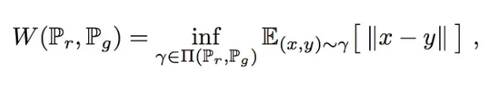
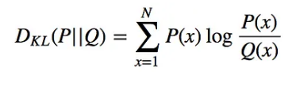
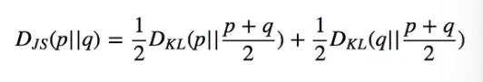

Hui, J., 2021. GAN — Wasserstein GAN & WGAN-GP [WWW Document]. Medium. URL https://jonathan-hui.medium.com/gan-wasserstein-gan-wgan-gp-6a1a2aa1b490 (accessed 1.31.23).

Arjovsky, M., Chintala, S., Bottou, L., 2017. Wasserstein GAN [WWW Document]. arXiv.org. URL https://arxiv.org/abs/1701.07875v3 (accessed 2.1.23).

# 1. What is the 'W' in WGAN?  
> W here is Wasserstein named after mathematical concept wasserstein distance (Arjovsky et al., 2017) 

## 1.1 What is Wasserstein loss or Earth-Mover(EM) distance
> Wasserstein distance is the minimum cost of transporting mass in converting the data distribution q to the data distribution p. 

From the WGAN paper (Arjovsky et al., 2017) :
The intuition of the formula above is measuring the distance between 2 distribution

> Simplified formula: D(x) - D(G(z))

D(x) is the critic's output for a real instance.
G(z) is the generator's output when given noise z.
D(G(z)) is the critic's output for a fake instance

It takes confidence of the discriminator's  prediction on a real image and then deducting the confidennce of the discrinator's prediction for a fake image

## 1.12 How is WGAN better

From the Wasserstein GAN (Hui, 2021):
WGAN first looked at KL and JS divergence and realised that if the 2nd Gaussian distribution Q becomes too large , gradient of divergency diminishes and generator learns nothing.

KL uses 
JS divergence uses the KL diverge to calculate a more normalized score which gives a value between 0 to 1 . On top of that the measure of the difference between the real and fake distribution is symmetric. People also call the JS divergence the average KL divergence since it multiplies by half of pretty much the KL divergence formula.

 
The figure above from the original WGAN paper (Arjovsky et al., 2017) shows an optimal discriminator trying to differentiate two Gaussians (aka 2 types of images) using the original loss function Binary Cross entropy = abs(y_pred - y_true). However as it trains , the discriminator draws the boundaries but also result in a vanishing gradient. This is a huge problem because without the critic's gradient being fed to the generator , training process stops. However, the Wasserstein loss appears to provide a clean gradient for the generator to continue learning

### 1.121 Key benefits:
- removes vanishing gradient problem
- loss metric helps with generator's convergence 
- improves training stability

# 2. WGAN test

# 3. Evaluation

## 3.1 Loss function evaluation
Test was smooth and loss was very stable even for high epochs
 

	
## 3.2 FID Evaluation

## 3.3 Visual Evaluation

## 3.13 Conclusion of WGAN
